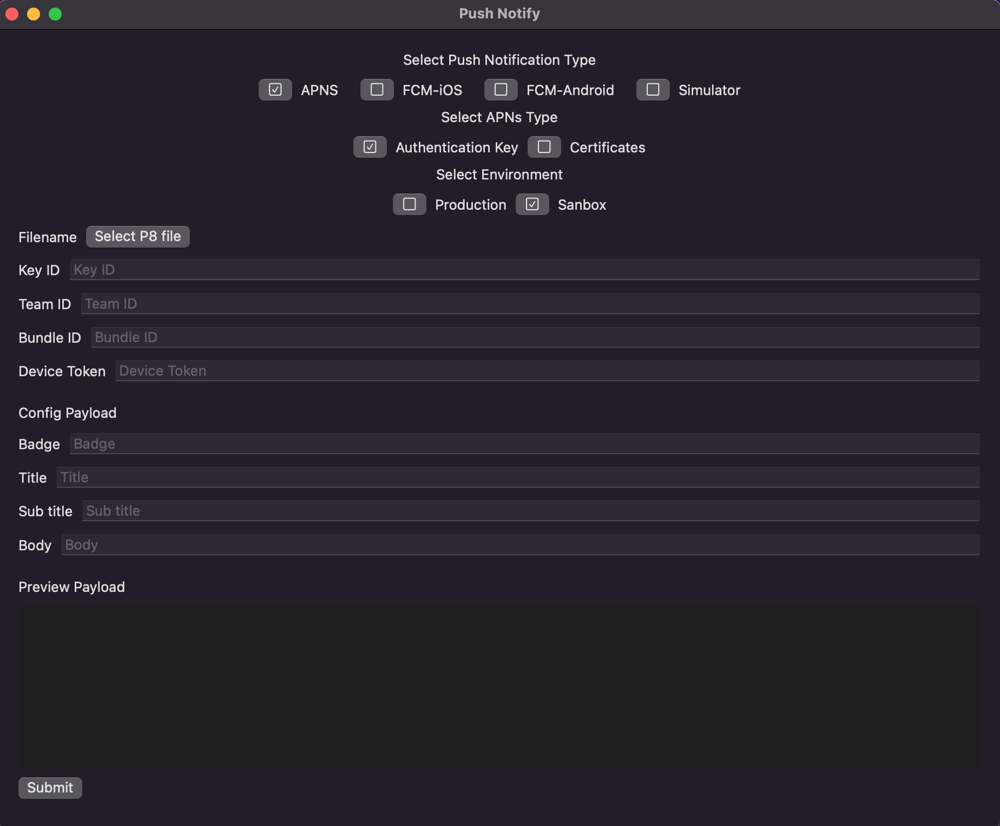
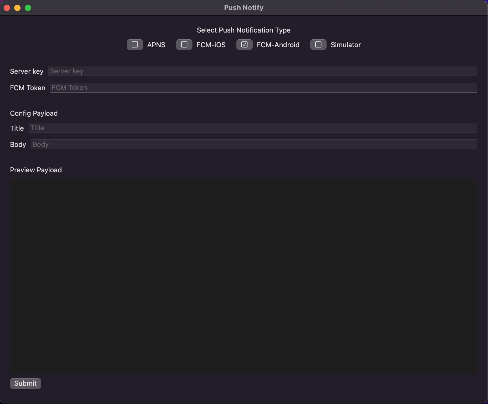

# Push-Notify

FAQ:
- How to download: go to [link](https://github.com/manhpham90vn/Push-Notify/releases)
- How to build project: you need [carthage](https://github.com/Carthage/Carthage) install first, run 
```shell
./install.sh
```

# Support 
## APNS With P8 file


## APNS With P12 file


## FCM


## Android


## iOS Simulator

